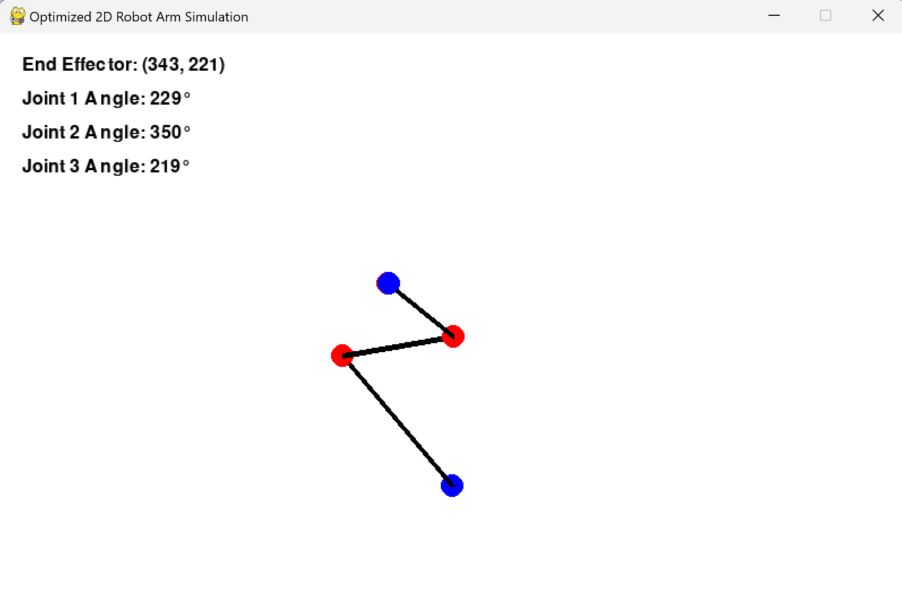

# 2D Robot Arm Simulation with Inverse Kinematics



This Python project simulates a 2D robotic arm controlled by inverse kinematics to reach a target point on the screen. The arm consists of multiple segments, and its joints are adjusted to move the end-effector (tip of the arm) towards a user-defined target, represented by a blue dot. The simulation includes smooth, optimized movements and interactive controls.

## ⭐ Features
- Simulates a 2D robotic arm with multiple segments.
- Implements Inverse Kinematics (IK) to move the arm's end-effector toward a target point.
- Smooth, real-time movement of joints, with optimizations for faster convergence.
- Interactive interface: Click to set a new target point for the arm to reach.
- Adjustable parameters for learning rate, iteration limits, and movement speed.
- Real-time visualization of joint positions, angles, and target distance.

## 🚧 Requirements

Ensure you have Python 3.x installed and the following Python libraries:

```bash
pip install pygame numpy
```

## 🔍 Usage
1. Clone the repository:
```bash
git clone https://github.com/jinc77/2DRobotArmSim.git
cd 2DRobotArmSim
```

2. Run the script:
```bash
python robot_arm.py
```

## 💻 Parameters
In the robot_arm.py file, you can adjust several parameters:
- `arm_lengths`: List of segment lengths for the robotic arm.
- `learning_rate`: The rate at which joint angles are adjusted to minimize error.
- `max_iterations`: Maximum number of iterations per frame for inverse kinematics.
- `smooth_factor`: Controls the speed of interpolation between current and target angles.

## 🎮 Interactive Controls
- **Set Target**: Left-click anywhere on the screen to set a new target (blue dot). The robotic arm will move its end-effector to this point.

## 💾 Example
```python
# Example usage in robot_arm.py
arm_lengths = [150, 100, 75]  # Lengths of the 3 segments of the arm
learning_rate = 0.2           # Faster angle adjustments
max_iterations = 30           # More iterations for quicker convergence
smooth_factor = 0.2           # Faster interpolation for smoother movement
```

These settings configure a 3-segment arm that responds quickly and smoothly to target changes.

## 🌐 Visualization
- The screen shows the robotic arm with its joint positions marked in red and the target position as a blue dot.
- Joint angles and the current position of the end-effector are displayed in real-time.

## 📐 Linear Algebra in Inverse Kinematics
The core of this project relies on linear algebra to solve the inverse kinematics problem, determining the joint angles necessary to position the end-effector at the target.

1. **Vector Representation:**
  - Each segment of the robotic arm is treated as a vector. The position of the end-effector is calculated using the sum of these vectors, starting from the base of the arm:
    $\[\text{End-Effector Position} = \sum_{i=1}^{n} \left( \text{Length}_i \cdot \left( \cos(\theta_i), \sin(\theta_i) \right) \right)]\$
2. **Jacobian Matrix:**
  - n the Jacobian Transpose method, the relationship between small changes in joint angles (Δ𝜃) and the resulting changes in the end-effector’s position (Δ𝑥, Δ𝑦) is described using the Jacobian matrix:
    $\[\Delta \mathbf{x} = J \cdot \Delta \boldsymbol{\theta}]\$ 
where 𝐽 is the Jacobian matrix, and Δ𝜃 represents the small changes in joint angles. The Jacobian matrix captures the partial derivatives of the end-effector’s position with respect to each joint angle.
3. **Jacobian Transpose Method:**
    -  To adjust the joint angles, we use the Jacobian Transpose method to calculate an update for the angles:
      $\[\text{cross product} = v_1[0] \cdot v_2[1] - v_1[1] \cdot v_2[0]]\$
    where 𝑒 is the error vector between the current end-effector position and the target, 𝐽^𝑇 is the transpose of the Jacobian, and 𝛼 is the learning rate. This method iteratively adjusts the joint angles until the end-effector reaches the target position.
4. **Cross Product for Rotation:**
  - When calculating how much to rotate a joint, we use the 2D cross product to find the direction and magnitude of the needed rotation. The cross product between the vector pointing from the joint to the end-effector and the vector pointing from the joint to the target gives the necessary rotation adjustment.
    
By leveraging these linear algebra concepts, the simulation can efficiently compute how each joint needs to move to reach the target, making the arm's movement both accurate and smooth.

## 💡 Optimization Notes
- **Learning Rate**: Controls how aggressively the joint angles are updated. A higher learning rate can speed up movement but may result in instability.
- **Max Iterations**: Increasing this parameter allows for more refined updates per frame, helping the arm reach the target faster.
- **Smooth Factor**: Controls how quickly the current angles interpolate to the target angles, affecting how smooth or jerky the movement appears.

## 🧠 License
This project is licensed under the MIT License. See the [LICENSE](LICENSE) file for details.

## 📝 Contributing
Feel free to submit issues or pull requests! Contributions are welcome.

## ❤️ Acknowledgements
- Uses the **Pygame** library for real-time visualization and interaction.
- **Numpy** for efficient mathematical computations in inverse kinematics.
